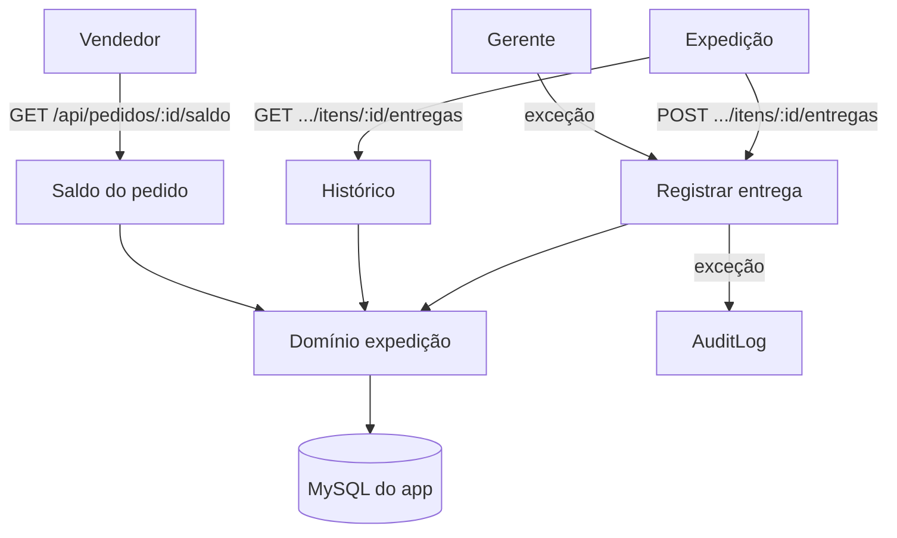

# Disponibilidade e Entregas — Design

**Spec**: `.specs/features/disponibilidade-e-entregas/spec.md`
**Status**: Draft

---

## Architecture Overview

Domínio novo em `src/modules/expedicao/` (disponibilidade, entrega, saldo do pedido, histórico) com porta `ExpedicaoRepository` e adapter Prisma. Os papéis do usuário vêm de `UserRole`, identificados pelo usuário atual (cabeçalho temporário).

---

## Code Reuse Analysis

| Component | Location | How to Use |
| --- | --- | --- |
| Guarda de token | `src/shared/http/internal-auth.ts` | Proteger as rotas. |
| Cliente Prisma | `src/shared/db/prisma.ts` | Repositório. |
| Domínio de produção | `src/modules/producao/` | Soma de execuções e padrão de portas. |
| Ocorrências | `src/modules/ocorrencias/` | Padrão de `AuditLog` e rotas. |
| Schema Prisma | `prisma/schema.prisma` | `Delivery`, `OrderItem`, `Execution`, `UserRole`, `AuditLog`. |

---

## Components

### `disponibilidade`

- **Purpose**: Calcular disponível = executado − entregue.
- **Location**: `src/modules/expedicao/disponibilidade.ts`
- **Interfaces**: `calcularDisponivel({ executado, entregue }): Decimal`.

### `registrar-entrega`

- **Purpose**: Validar papel, bloquear acima do disponível e registrar exceção com auditoria.
- **Location**: `src/modules/expedicao/registrar-entrega.ts`
- **Interfaces**: `registrarEntrega({ itemId, usuarioId, quantidade, excecao?, motivoExcecao? })`; porta `ExpedicaoRepository`.

### `saldo-pedido`

- **Purpose**: Consolidar solicitado, executado, disponível, entregue e pendente por item.
- **Location**: `src/modules/expedicao/saldo-pedido.ts`
- **Interfaces**: `saldoPedido(orderId)`.

### `historico-entregas`

- **Purpose**: Listar entregas de um item.
- **Location**: `src/modules/expedicao/historico-entregas.ts`
- **Interfaces**: `listarEntregas(itemId)`.

### Adapter e rotas

- `src/modules/expedicao/adapters/prisma-expedicao-repository.ts`.
- `src/app/api/pedidos/itens/[itemId]/entregas/route.ts` — `POST`/`GET`.
- `src/app/api/pedidos/[orderId]/saldo/route.ts` — `GET`.

---

## Data Models

Sem mudança de schema. Usa `Delivery` (`quantity`, `managerOverride`, `overrideReason`, `authorizedByUserId`, `availableBefore`, `occurredAt`), `OrderItem`, `Execution`, `UserRole`, `AuditLog`.

Status de entrega do item é derivado: `PARCIAL` enquanto entregue < executado; `CONCLUIDO` quando entregue ≥ executado.

---

## Error Handling Strategy

| Error Scenario | Handling | User Impact |
| --- | --- | --- |
| Papel sem permissão | `403` | Sem permissão. |
| Entrega acima do disponível | `409` | Bloqueada; pedir gerente. |
| Exceção sem motivo / não-gerente | `400`/`403` | Exceção recusada. |
| Item inexistente | `404` | Não encontrado. |
| Quantidade inválida | `400` | Quantidade inválida. |

---

## Risks & Concerns

| Concern | Location | Impact | Mitigation |
| --- | --- | --- | --- |
| Sem autenticação | rotas | Papel não confiável | Papéis lidos de `UserRole` pelo usuário atual; auth na próxima feature. |
| Indisponibilidade de Revenda | RN031 | Saldo incerto | Não entra no disponível nesta versão. |
| Concorrência na entrega | `Delivery` | Sobrevenda | Cálculo e gravação em transação. |

---

## Tech Decisions

| Decision | Choice | Rationale |
| --- | --- | --- |
| Disponível | executado − entregue | RN002. |
| Status do item | Derivado | RN004; sem novo campo. |
| Exceção | Gerente + motivo + `AuditLog` | RN005. |
| Papéis | `UserRole` | Auth ainda não existe. |
