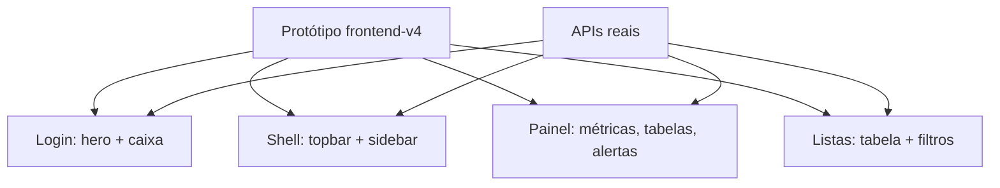

# Frontend fiel ao protótipo — Design

**Spec**: `.specs/features/frontend-prototipo/spec.md`
**Status**: Draft

---

## Architecture Overview

Replica a estrutura do protótipo `frontend-v4` nas páginas React, com dados reais das APIs. Pequeno ajuste **aditivo** na consulta de pedidos para exibir descrição/código/unidade do item e cliente/vendedor do pedido.

---

## Code Reuse Analysis

| Component | Location | How to Use |
| --- | --- | --- |
| Tokens (teal) | `src/app/globals.css` | Base do protótipo. |
| Componentes | `src/shared/ui/` (Metric, Badge, PageHead, Card, Alert, EmptyState) | Base das telas. |
| Protótipo | `design/inspiracoes/frontend-v4/` | Estrutura/estilo a seguir. |
| Consulta de pedidos | `src/modules/indicadores/consulta-pedidos.ts` | Enriquecer (aditivo). |

---

## Components

- `src/modules/indicadores/consulta-pedidos.ts` (+ adapter) — incluir `description`, `productCode`, `unit` por item e `customerName`, `sellerLegacyCode` no pedido.
- `src/app/login/page.tsx` — login fiel (hero + caixa).
- `src/shared/ui/app-shell.tsx` — topbar + sidebar fiéis.
- Telas `src/app/(app)/**` — painel, pedidos (tabela + filtros), fila (cards), etc.

---

## Data Models

Sem mudança de schema. A resposta de `GET /api/pedidos/[orderId]` passa a incluir campos **adicionais** (aditivo, não quebra contrato): por item `description`, `productCode`, `unit`; no pedido `customerName`, `sellerLegacyCode`.

---

## Error Handling Strategy

| Error Scenario | Handling | User Impact |
| --- | --- | --- |
| Lista vazia | Estado vazio do protótipo | Sem dados. |
| Falha de API | Alerta padrão | Tentar de novo. |
| Tela estreita | Sidebar vira menu; tabela rola | Uso normal. |

---

## Risks & Concerns

| Concern | Location | Impact | Mitigation |
| --- | --- | --- | --- |
| Contrato da API | `consulta-pedidos.ts` | Regressão | Mudança aditiva; testes existentes mantidos. |
| Vendedor sem nome | AWS `cad_vendedor` vazia | Só código | Exibir o código; nome quando existir. |
| Fidelidade vs a11y | telas | Contraste/foco | Manter tokens AA e foco visível. |

---

## Tech Decisions

| Decision | Choice | Rationale |
| --- | --- | --- |
| Enriquecer consulta | Aditivo | Mostrar descrição/código/unidade/vendedor. |
| Fidelidade | Estrutura do protótipo | Pedido do usuário. |
| Sem demo | Não incluir textos do protótipo | Pedido do usuário. |
| Mobile | Sidebar → menu | Usabilidade. |
