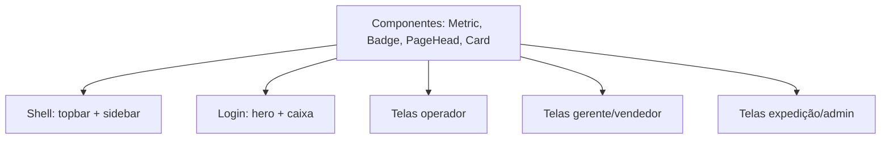

# Frontend — Refino Visual — Design

**Spec**: `.specs/features/frontend-visual/spec.md`
**Status**: Draft

---

## Architecture Overview

Refino visual sobre a base existente (Tailwind + componentes React). Adiciona componentes de apresentação, troca o shell para **topbar + sidebar** e o login para **hero + caixa**, e aplica o padrão nas telas — sem alterar comportamento.

---

## Code Reuse Analysis

| Component | Location | How to Use |
| --- | --- | --- |
| Tokens (cores/teal) | `src/app/globals.css` | Já alinhados à referência. |
| Componentes base | `src/shared/ui/` (Button, Input, Field, Card, Badge, Spinner, EmptyState, Alert) | Reusar e estender. |
| Navegação por perfil | `src/shared/ui/navegacao-perfil.ts` | Itens da sidebar. |
| Referência visual | `design/inspiracoes/frontend-v4/` | Inspiração (não spec). |
| Páginas | `src/app/(app)/**` | Restyle preservando os testes. |

---

## Components

- `src/shared/ui/metric.tsx` — card de métrica (rótulo + valor + variação).
- `src/shared/ui/badge.tsx` — selo de estado (texto + cor).
- `src/shared/ui/page-head.tsx` — título + descrição + ações.
- `src/shared/ui/app-shell.tsx` (ajuste) — topbar + sidebar responsivos.
- `src/app/login/page.tsx` (ajuste) — hero + caixa.
- Telas `src/app/(app)/**` — aplicam o padrão.

---

## Error Handling Strategy

| Error Scenario | Handling | User Impact |
| --- | --- | --- |
| Lista vazia | `EmptyState` | Sem dados. |
| Falha de API | `Alert` | Tentar de novo. |
| Tela estreita | Sidebar vira menu; tabela rola | Uso normal. |

---

## Risks & Concerns

| Concern | Location | Impact | Mitigation |
| --- | --- | --- | --- |
| Quebrar comportamento | páginas | Regressão | Só apresentação; testes existentes mantidos. |
| Rolagem horizontal | shell/tabelas | Layout quebrado | Sidebar oculta no mobile; tabela com scroll interno. |
| Contraste | tokens | Acessibilidade | Tokens AA; foco visível. |

---

## Tech Decisions

| Decision | Choice | Rationale |
| --- | --- | --- |
| Shell | Sidebar + topbar | Referência; melhor em desktop. |
| Mobile | Sidebar vira menu | Responsividade. |
| Componentes | Primitivos reutilizáveis | Padronização. |
| Comportamento | Inalterado | Refino visual. |
