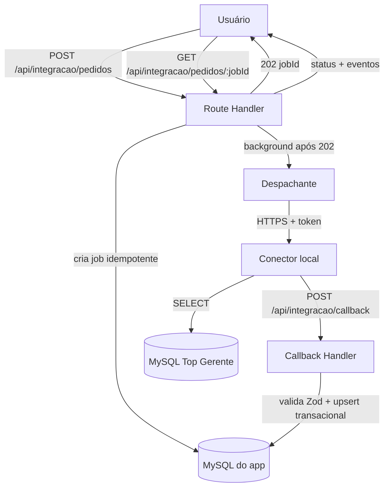

# Importação de Pedido por Número — Design

**Spec**: `.specs/features/importacao-pedido-por-numero/spec.md`
**Context**: `.specs/features/importacao-pedido-por-numero/context.md`
**Status**: Draft

---

## Architecture Overview

O app cria um `IntegrationJob` idempotente, responde `202` e despacha em background para o conector local. O conector lê o Top Gerente (`orcamento` + `orcamento_itens`), normaliza e devolve por callback autenticado. O app valida com Zod e faz upsert transacional de `Pedido` + `ItemPedido`.



---

## Approach Exploration

| Approach | Descrição | Prós | Contras |
| --- | --- | --- | --- |
| **A (recomendado)** | Despacho em background após o `202`, dentro do próprio processo Next.js (`after()`). | Sem infra extra; simples; cabe no Railway. | Depende do processo continuar vivo; exige status + reprocesso para recuperação. |
| B | Worker/fila dedicado que consome jobs `PENDING` do banco. | Robusto, retry e desacoplamento naturais. | Infra e código a mais; overkill para o volume atual. |
| C | Despacho síncrono dentro da requisição (espera o callback). | Mais simples de depurar. | Fura o contrato `202`; prende a requisição à latência do legado. |

**Recomendação: A.** O volume é baixo, o Railway roda processo Node de longa duração, e a recuperação fica coberta pelo status (P1) e pelo reprocesso manual (P3). B vira evolução se o volume crescer.

---

## Code Reuse Analysis

### Existing Components to Leverage

| Component | Location | How to Use |
| --- | --- | --- |
| Cliente Prisma | `src/shared/db/prisma.ts` | Reusar para os repositórios Prisma. |
| Timezone | `src/shared/time/timezone.ts` | Persistir UTC, exibir `America/Sao_Paulo`. |
| Conector bootstrap | `connector-local/src/index.ts` | Estender o handler `/jobs/import-order` já esboçado. |
| Schema Prisma | `prisma/schema.prisma` | `Order`, `OrderItem`, `IntegrationJob`, `IntegrationJobEvent`, `AuditLog` já existem. |
| Healthcheck | `src/app/api/health/route.ts` | Referência de Route Handler. |

### Integration Points

| System | Integration Method |
| --- | --- |
| Top Gerente (MySQL) | SELECT parametrizado no conector, usuário somente leitura. |
| Conector local | HTTPS com token; `LOCAL_CONNECTOR_BASE_URL` + `LOCAL_CONNECTOR_TOKEN`. |
| Banco do app | Prisma, upsert transacional. |

---

## Components

### `integracao` (domínio)

- **Purpose**: Casos de uso do job de importação e regras de idempotência/estado.
- **Location**: `src/modules/integracao/`
- **Interfaces**:
  - `solicitarImportacao(orderNumber: string, now: Date): Promise<{ jobId: string }>`
  - `consultarStatus(jobId: string): Promise<JobStatus>`
  - `processarCallback(payload: CallbackPayload): Promise<void>`
  - `reprocessar(jobId: string): Promise<{ jobId: string }>`
- **Dependencies**: portas `IntegracaoRepository`, `PedidosRepository`, `ConectorLegadoPort`.
- **Reuses**: nada de domínio ainda; só infra compartilhada.

### `pedidos` (domínio)

- **Purpose**: Upsert de pedido e itens comerciais importados.
- **Location**: `src/modules/pedidos/`
- **Interfaces**:
  - `importarPedido(pedido: PedidoImportado): Promise<{ orderId: string; divergente: boolean }>`
- **Dependencies**: porta `PedidosRepository`.
- **Reuses**: schema Prisma `Order`/`OrderItem`.

### Adapters de infraestrutura

- **Location**: `src/modules/integracao/adapters/`, `src/modules/pedidos/adapters/`
- `HttpConectorLegadoAdapter` — chama o conector com token e timeout.
- `PrismaIntegracaoRepository`, `PrismaPedidosRepository` — persistência.
- **Reuses**: `src/shared/db/prisma.ts`.

### Route Handlers

- `src/app/api/integracao/pedidos/route.ts` — `POST` cria job.
- `src/app/api/integracao/pedidos/[jobId]/route.ts` — `GET` status.
- `src/app/api/integracao/callback/route.ts` — `POST` callback autenticado.

### Conector local

- **Location**: `connector-local/src/`
- **Interfaces**: `POST /jobs/import-order` — autentica, consulta o legado, normaliza e chama o callback.
- **Reuses**: esqueleto em `connector-local/src/index.ts` (express + zod).

---

## Data Models

Já existem no Prisma. Ajustes desta feature:

### Order (ajuste)

```typescript
// adicionar
sellerLegacyCode: string | null  // código Vend; nome indisponível no legado
```

Campos usados: `legacyOrderKey = "${emp}:${orc}"`, `legacyNumber = String(orc)`, `customerName = nome_cliente`, `sourceUpdatedAt = Data`, `lastSyncedAt = now`.

### OrderItem (sem ajuste de schema)

`legacyItemKey = String(seq)`, `productCode = Prod`, `description = descr_produto`, `unit = unidade_venda || unidade`, `requestedQuantity = Qtde`, `legacyCategory = null`, `classificationStatus = PENDING_CLASSIFICATION`.

### Contrato de despacho (app → conector)

```typescript
{ jobId: string; orderNumber: string }
```

### Contrato de callback (conector → app)

```typescript
{
  jobId: string
  order: {
    emp: number; orc: number
    legacyOrderKey: string; legacyNumber: string
    customerName: string | null
    sellerCode: string | null
    sourceUpdatedAt: string | null   // ISO date
  }
  items: Array<{
    seq: number
    productCode: string
    description: string
    unit: string
    requestedQuantity: string        // decimal como string
    legacyCategory: string | null
  }>
}
```

Validado com Zod nos dois lados. `requestedQuantity` trafega como string para não perder precisão.

### Estados do job

`PENDING → DISPATCHED → RUNNING → SUCCEEDED | FAILED`

Transições inválidas são rejeitadas. `FAILED` só reprocessa via P3.

---

## Error Handling Strategy

| Error Scenario | Handling | User Impact |
| --- | --- | --- |
| Número inválido | `400`, sem criar job | Mensagem de validação. |
| Conector indisponível/timeout | Job `FAILED`, `errorCode = CONNECTOR_TIMEOUT` | Vê falha e pode reprocessar. |
| Pedido inexistente no legado | Job `FAILED`, `errorCode = ORDER_NOT_FOUND` | Vê "pedido não encontrado". |
| Callback com token inválido | `401`, nada persistido | Sem efeito. |
| Callback duplicado | `200`, sem repetir upsert | Sem efeito. |
| Falha no upsert | Transação revertida, job `FAILED` | Vê falha e pode reprocessar. |

---

## Risks & Concerns

| Concern | Location | Impact | Mitigation |
| --- | --- | --- | --- |
| Credenciais do legado em texto puro (PDF) | `Downloads/*.pdf` | Vazamento de acesso ao RDS | Manter fora do repo; usar só em env do conector; considerar rotação. |
| Rota sem autenticação real | `src/app/api/integracao/*` | Acesso indevido à importação | Token interno temporário até a feature de auth. |
| Despacho em background pode se perder | `after()` no Route Handler | Job preso em `DISPATCHED` | Status + reprocesso manual (P3); revisar se o volume crescer. |
| `cad_produto` vazia | RDS de treino | Sem categoria para classificar | Item `PENDING_CLASSIFICATION`; mapeamento configurável no app. |
| Precisão decimal | `Qtde` `double(11,5)` no legado | Erro de arredondamento | Trafegar decimal como string; `Decimal(18,3)` no app. |
| Teste do conector depende do RDS | `connector-local` | Testes lentos/frágeis | Fake do repositório do legado nos testes. |

---

## Tech Decisions

| Decision | Choice | Rationale |
| --- | --- | --- |
| Despacho assíncrono | Background após o `202` (Approach A) | Menor complexidade; recuperação via status + reprocesso. |
| Janela de idempotência | 60 s por número de pedido | Evita jobs duplicados em duplo clique; simples. |
| Chave do pedido | `legacyOrderKey = "${emp}:${orc}"` | `orcamento` tem PK composta `Emp`+`Orc`. |
| Chave do item | `legacyItemKey = String(seq)` | `Seq` é único por pedido. |
| Vendedor | Nova coluna `Order.sellerLegacyCode` | Guardar o código sem poluir `sellerName`. |
| Categoria | `null` + `PENDING_CLASSIFICATION` | Indisponível no legado acessível. |
| Retry | Nenhum automático na v1 | Evita carga no legado; ADR 0001. |
| Token interno temporário | `APP_INTERNAL_TOKEN` nas rotas | Protege até a feature de auth. |

> **Project-level decisions** (vão para `.specs/STATE.md` `## Decisions`): fonte do legado (`orcamento` + `orcamento_itens` via conector/RDS) e padrão "adapter real + fake nos testes, domínio sem DB".
