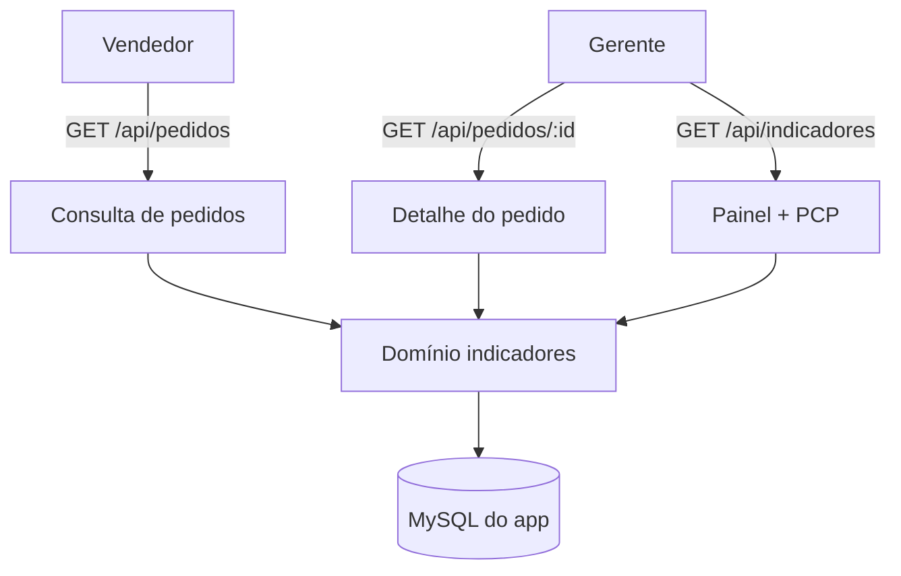

# Indicadores e Consulta — Design

**Spec**: `.specs/features/indicadores-e-consulta/spec.md`
**Status**: Draft

---

## Architecture Overview

Domínio novo em `src/modules/indicadores/` (consulta de pedidos, painel, PCP) com porta `IndicadoresRepository` e adapter Prisma. Tudo somente leitura; reusa o cálculo de saldo da expedição.

---

## Code Reuse Analysis

| Component | Location | How to Use |
| --- | --- | --- |
| Saldo do pedido | `src/modules/expedicao/saldo-pedido.ts` | Reusar no detalhe. |
| Contexto de auth | `src/shared/http/autorizacao.ts` | Proteger as rotas (`consultar_pedidos`). |
| Cliente Prisma | `src/shared/db/prisma.ts` | Repositório. |
| Schema Prisma | `prisma/schema.prisma` | `Order`, `OrderItem`, `Activity`, `Execution`, `Sector`. |

---

## Components

### `consulta-pedidos`

- **Purpose**: Listar pedidos com filtros e detalhar um pedido.
- **Location**: `src/modules/indicadores/consulta-pedidos.ts`
- **Interfaces**: `listarPedidos({ cliente?, setor?, status?, de?, ate?, limite, offset })`, `detalharPedido(orderId)`; porta `IndicadoresRepository`.

### `painel`

- **Purpose**: Contagem de atividades por setor/status e pendências.
- **Location**: `src/modules/indicadores/painel.ts`
- **Interfaces**: `montarPainel()`.

### `pcp`

- **Purpose**: Produção por setor e cumprimento de prazo.
- **Location**: `src/modules/indicadores/pcp.ts`
- **Interfaces**: `montarPcp(agora)`.

### Adapter e rotas

- `src/modules/indicadores/adapters/prisma-indicadores-repository.ts`.
- `src/app/api/pedidos/route.ts` — `GET`.
- `src/app/api/pedidos/[orderId]/route.ts` — `GET`.
- `src/app/api/indicadores/route.ts` — `GET`.

---

## Data Models

Sem mudança de schema. Leitura de `Order`, `OrderItem`, `Activity`, `Execution`, `Sector`.

Indicadores: produção por setor = soma de `Execution.quantity`; cumprimento de prazo = concluídas dentro do prazo ÷ concluídas com prazo.

---

## Error Handling Strategy

| Error Scenario | Handling | User Impact |
| --- | --- | --- |
| Pedido inexistente | `404` | Não encontrado. |
| Sem sessão | `401` | Precisa logar. |
| Filtro inválido | `400` | Validação. |

---

## Risks & Concerns

| Concern | Location | Impact | Mitigation |
| --- | --- | --- | --- |
| Consultas pesadas | `Order`/`Activity` | Lentidão | Paginação e índices existentes. |
| Indicador de prazo ambíguo | `Activity` | Número enganoso | Contar só atividades com prazo. |
| Vendedor com escrita | rotas | Violação de permissão | Rotas são só `GET`. |

---

## Tech Decisions

| Decision | Choice | Rationale |
| --- | --- | --- |
| Somente leitura | Rotas `GET` | RF008; vendedor só consulta. |
| Paginação | Limite/offset | Consulta previsível. |
| Indicadores | Só banco do app | Não sobrecarregar o legado. |
| Cumprimento de prazo | Só atividades com prazo | RN de prazos. |
