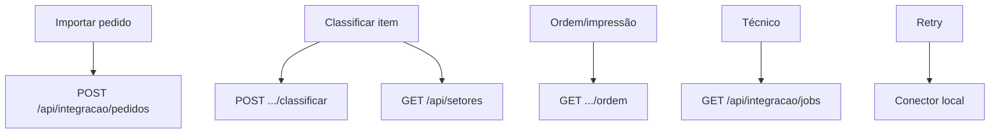

# Lacunas Operacionais — Design

**Spec**: `.specs/features/lacunas-operacionais/spec.md`
**Status**: Draft

---

## Architecture Overview

Fecha as lacunas de interface e robustez: telas de importar/classificar/ordem/técnico, e retry no despacho. Dois ajustes pequenos de API: listar jobs de integração e permitir a leitura de setores a quem classifica.

---

## Code Reuse Analysis

| Component | Location | How to Use |
| --- | --- | --- |
| Despacho | `src/app/api/integracao/despacho.ts` | Adicionar retry/backoff. |
| Consulta de pedidos | `src/modules/indicadores/consulta-pedidos.ts` | Reusar no detalhe. |
| Componentes UI | `src/shared/ui/` | PageHead, Metric, Badge, Card, Alert. |
| Setores | `src/modules/setores/gerenciar-setores.ts` | Listar para classificar. |

---

## Components

- `src/app/api/integracao/despacho.ts` — retry com backoff (env `CONNECTOR_MAX_ATTEMPTS`).
- `src/app/api/integracao/jobs/route.ts` — `GET` lista de jobs (técnico).
- `src/app/api/setores/route.ts` — `GET` passa a exigir `consultar_pedidos` (leitura).
- `src/app/(app)/integracao/page.tsx` — importar pedido.
- `src/app/(app)/gerente/pedidos/[orderId]/page.tsx` — classificar item.
- `src/app/(app)/producao/atividades/[id]/ordem/page.tsx` — ordem + impressão.
- `src/app/(app)/tecnico/integracao/page.tsx` — jobs e eventos.

---

## Error Handling Strategy

| Error Scenario | Handling | User Impact |
| --- | --- | --- |
| Falha transitória | Retry antes de `FAILED` | Menos falhas falsas. |
| Número inválido | Erro sem chamar a API | Corrigir. |
| Sem permissão | `403` | Sem acesso. |

---

## Risks & Concerns

| Concern | Location | Impact | Mitigation |
| --- | --- | --- | --- |
| Mudar permissão do GET setores | `api/setores` | Acesso de leitura | Leitura não é sensível; POST/PATCH seguem restritos. |
| Impressão | CSS | Layout | `@media print`. |
| Retry em erro definitivo | `despacho` | Repetição inútil | Só erros transitórios. |

---

## Tech Decisions

| Decision | Choice | Rationale |
| --- | --- | --- |
| Retry | 3 tentativas, backoff 1s | Transitórios. |
| Listar jobs | Nova rota `GET` | Técnico. |
| Setores (leitura) | `consultar_pedidos` | Classificar precisa da lista. |
| Impressão | `@media print` | RF018. |
