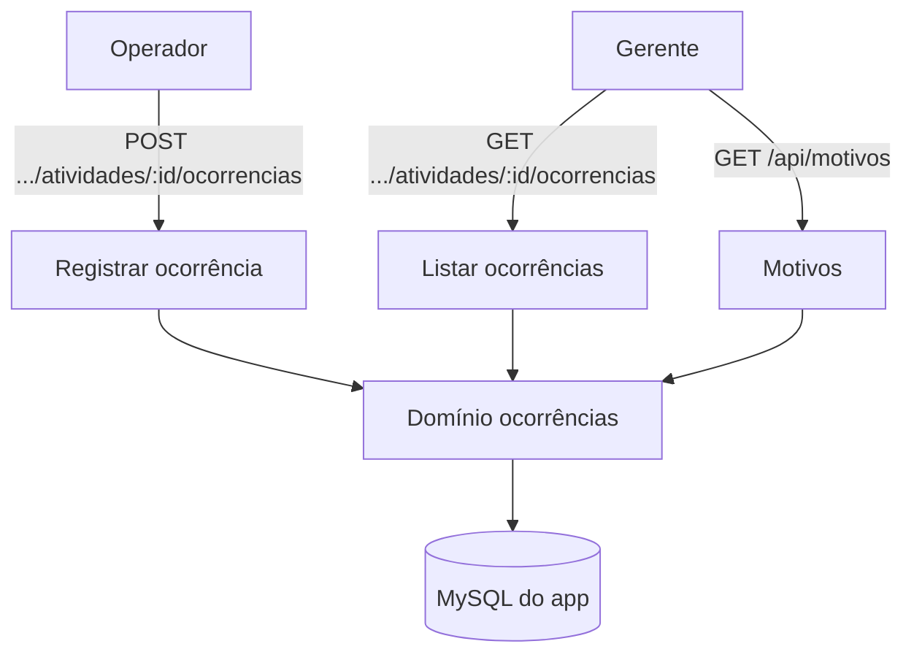

# Ocorrências — Design

**Spec**: `.specs/features/ocorrencias/spec.md`
**Status**: Draft

---

## Architecture Overview

Domínio novo em `src/modules/ocorrencias/` (motivos, registrar, listar) com portas e adapter Prisma. Uma nova entidade `MotivoOcorrencia` passa a ser a lista fechada; `Occurrence` ganha `motivoId`. Perda/refugo não alteram o saldo de produção.

---

## Code Reuse Analysis

| Component | Location | How to Use |
| --- | --- | --- |
| Guarda de token | `src/shared/http/internal-auth.ts` | Proteger as rotas. |
| Cliente Prisma | `src/shared/db/prisma.ts` | Repositório. |
| Domínio de produção | `src/modules/producao/` | Padrão de portas, unidade e `x-user-id`. |
| Schema Prisma | `prisma/schema.prisma` | `Occurrence`, `Activity`, `OrderItem`. |
| Sugestões de motivo | `docs/backlog/motivos-ocorrencia.md` | Carga inicial marcada como sugestão. |

---

## Components

### `motivos`

- **Purpose**: Listar motivos ativos por tipo e validar o vínculo motivo↔tipo.
- **Location**: `src/modules/ocorrencias/motivos.ts`
- **Interfaces**: `listarMotivos(tipo)`, `validarMotivo(tipo, motivoId)`; porta `MotivoRepository`; constante `MOTIVOS_SUGERIDOS`.

### `registrar-ocorrencia`

- **Purpose**: Validar e persistir a ocorrência.
- **Location**: `src/modules/ocorrencias/registrar-ocorrencia.ts`
- **Interfaces**: `registrarOcorrencia({ atividadeId, usuarioId, tipo, quantidade?, duracaoMin?, motivoId?, observacao? })`; porta `OcorrenciaRepository`.

### `listar-ocorrencias`

- **Purpose**: Listar ocorrências de uma atividade.
- **Location**: `src/modules/ocorrencias/listar-ocorrencias.ts`
- **Interfaces**: `listarOcorrencias(atividadeId)`.

### Adapter e rotas

- `src/modules/ocorrencias/adapters/prisma-ocorrencias-repository.ts`.
- `src/app/api/producao/atividades/[id]/ocorrencias/route.ts` — `POST`/`GET`.
- `src/app/api/motivos/route.ts` — `GET` (filtro `?tipo=`).

---

## Data Models

Mudança de schema:
- Nova entidade `MotivoOcorrencia`: `id`, `tipo`, `codigo`, `descricao`, `ativo`, `@@unique([tipo, codigo])`.
- `Occurrence`: adiciona `motivoId String?` + relação `motivo`; remove `reasonCode` (substituído pela lista fechada).

---

## Error Handling Strategy

| Error Scenario | Handling | User Impact |
| --- | --- | --- |
| Perda/refugo/indisponibilidade sem motivo | `400` | Mensagem de validação. |
| Motivo inexistente/inativo/tipo errado | `400` | Motivo inválido. |
| Quantidade fora da unidade | `400` | Quantidade inválida. |
| Atividade inexistente | `404` | Não encontrada. |
| Operador fora do setor | `403` | Sem permissão. |

---

## Risks & Concerns

| Concern | Location | Impact | Mitigation |
| --- | --- | --- | --- |
| Lista de motivos não validada | `docs/backlog/motivos-ocorrencia.md` | Pode mudar | Carga inicial como sugestão; configurável. |
| Efeito da indisponibilidade | RN031 | Saldo de Revenda incerto | Registrar sem alterar saldo; validar depois. |
| Sem autenticação | rotas | Usuário não confiável | `x-user-id` temporário até a feature de auth. |

---

## Tech Decisions

| Decision | Choice | Rationale |
| --- | --- | --- |
| Lista fechada | Entidade `MotivoOcorrencia` | Não usar texto livre. |
| Efeito no saldo | Perda/refugo não alteram | Decisão vigente. |
| Motivo obrigatório | Perda, refugo, indisponibilidade | RN012, RN023, RN032. |
| Quantidade | Validada pela unidade do item | RN003. |
