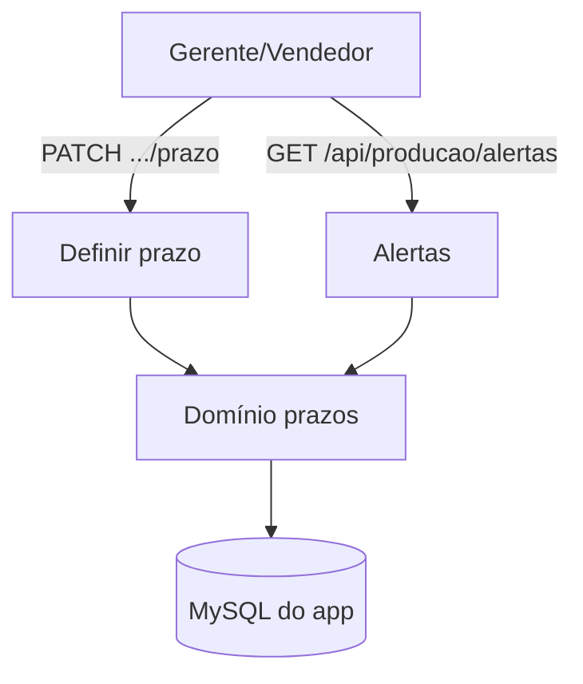

# Prazos e Alertas — Design

**Spec**: `.specs/features/prazos-e-alertas/spec.md`
**Status**: Draft

---

## Architecture Overview

Domínio novo em `src/modules/prazos/` (prazo, atraso, alertas) com porta `PrazosRepository` e adapter Prisma. Prazo por item (`OrderItem.deadlineAt`) e por atividade (`Activity.deadlineAt`). O status de atraso é derivado; não há novo campo.

---

## Code Reuse Analysis

| Component | Location | How to Use |
| --- | --- | --- |
| Contexto de auth | `src/shared/http/auth-context.ts`, `autorizacao.ts` | Proteger as rotas; ação `definir_prazo`. |
| Matriz de permissões | `src/modules/usuarios/permissoes.ts` | Já permite `definir_prazo` a gerente e vendedor. |
| Cliente Prisma | `src/shared/db/prisma.ts` | Repositório. |
| Schema Prisma | `prisma/schema.prisma` | `OrderItem.deadlineAt`, `Activity.deadlineAt`, `Activity.status`. |

---

## Components

### `prazo`

- **Purpose**: Definir e validar o prazo de item e de atividade.
- **Location**: `src/modules/prazos/prazo.ts`
- **Interfaces**: `definirPrazoItem({ itemId, prazo })`, `definirPrazoAtividade({ atividadeId, prazo })`; porta `PrazosRepository`.

### `atraso`

- **Purpose**: Calcular o status de prazo.
- **Location**: `src/modules/prazos/atraso.ts`
- **Interfaces**: `calcularStatusPrazo({ prazo, concluido, agora }): 'SEM_PRAZO' | 'EM_DIA' | 'ATRASADO'`.

### `alertas`

- **Purpose**: Listar atividades atrasadas.
- **Location**: `src/modules/prazos/alertas.ts`
- **Interfaces**: `listarAtividadesAtrasadas(agora)`.

### Adapter e rotas

- `src/modules/prazos/adapters/prisma-prazos-repository.ts`.
- `src/app/api/pedidos/itens/[itemId]/prazo/route.ts` — `PATCH`.
- `src/app/api/producao/atividades/[id]/prazo/route.ts` — `PATCH`.
- `src/app/api/producao/alertas/route.ts` — `GET`.

---

## Data Models

Sem mudança de schema. Usa `OrderItem.deadlineAt`, `Activity.deadlineAt`, `Activity.status`.

Regra de status: `SEM_PRAZO` quando não há data; `ATRASADO` quando `agora > prazo` e não concluído; caso contrário `EM_DIA`.

---

## Error Handling Strategy

| Error Scenario | Handling | User Impact |
| --- | --- | --- |
| Sem perfil para definir prazo | `403` | Sem permissão. |
| Data inválida | `400` | Validação. |
| Item/atividade inexistente | `404` | Não encontrado. |
| Sem sessão | `401` | Precisa logar. |

---

## Risks & Concerns

| Concern | Location | Impact | Mitigation |
| --- | --- | --- | --- |
| Fuso horário do prazo | datas | Atraso incorreto | Comparar em UTC (`agora`); exibir em `America/Sao_Paulo`. |
| Prazo por item e por setor | `deadlineAt` duplicado | Ambiguidade | Item = entrega; atividade = setor. |
| Sem alertas ativos | RF012 | Sem notificação | Aqui é consulta; notificação fica fora do escopo. |

---

## Tech Decisions

| Decision | Choice | Rationale |
| --- | --- | --- |
| Status derivado | `SEM_PRAZO`/`EM_DIA`/`ATRASADO` | Sem novo campo. |
| Atraso | Só com prazo e não concluído | `docs/regras-negocio.md`. |
| Permissão | `definir_prazo` (gerente, vendedor) | Matriz existente. |
| Alertas | Consulta de atividades atrasadas | RF012. |
