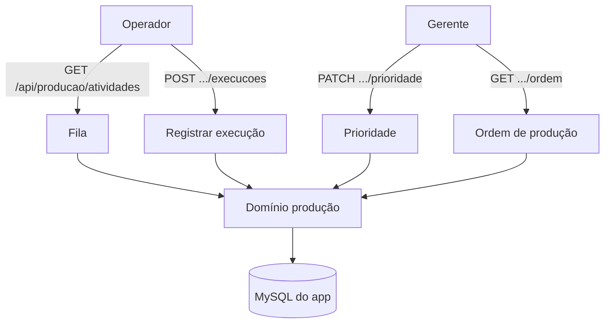

# Produção e Fila de Atividades — Design

**Spec**: `.specs/features/producao-e-fila/spec.md`
**Status**: Draft

---

## Architecture Overview

Domínio novo em `src/modules/producao/` (unidades, saldo, execução, fila, prioridade, ordem de produção) com porta `ProducaoRepository` e adapter Prisma. As rotas usam o token interno e um identificador de usuário temporário até a feature de autenticação.

---

## Code Reuse Analysis

| Component | Location | How to Use |
| --- | --- | --- |
| Guarda de token | `src/shared/http/internal-auth.ts` | Proteger as rotas. |
| Cliente Prisma | `src/shared/db/prisma.ts` | Repositório. |
| Portas/adapters | `src/modules/integracao/*`, `src/modules/setores/*` | Mesmo padrão. |
| Schema Prisma | `prisma/schema.prisma` | `Activity`, `Execution`, `OrderItem`, `UserSector`. |
| Atividades criadas | `src/modules/setores/classificar-item.ts` | Origem da fila. |

---

## Components

### `unidades`

- **Purpose**: Validar e formatar quantidade por unidade/setor.
- **Location**: `src/modules/producao/unidades.ts`
- **Interfaces**: `validarQuantidade(unidade, valor): Decimal`; `formatarQuantidade`.

### `saldo`

- **Purpose**: Calcular solicitado, executado e pendente.
- **Location**: `src/modules/producao/saldo.ts`
- **Interfaces**: `calcularSaldo({ solicitado, executado }): { solicitado, executado, pendente }`.

### `registrar-execucao`

- **Purpose**: Persistir execução, validar unidade e atualizar a situação da atividade.
- **Location**: `src/modules/producao/registrar-execucao.ts`
- **Interfaces**: `registrarExecucao({ atividadeId, usuarioId, quantidade })`; porta `ProducaoRepository`.

### `fila`

- **Purpose**: Listar atividades dos setores do usuário, ordenadas.
- **Location**: `src/modules/producao/fila.ts`
- **Interfaces**: `listarFila(usuarioId)`.

### `prioridade`

- **Purpose**: Definir a prioridade de uma atividade.
- **Location**: `src/modules/producao/prioridade.ts`
- **Interfaces**: `definirPrioridade({ atividadeId, prioridade })`.

### `ordem-producao`

- **Purpose**: Montar os dados de impressão da ordem de produção.
- **Location**: `src/modules/producao/ordem-producao.ts`
- **Interfaces**: `montarOrdemProducao(atividadeId)`.

### Adapter e rotas

- `src/modules/producao/adapters/prisma-producao-repository.ts`.
- `src/app/api/producao/atividades/route.ts` — `GET`.
- `src/app/api/producao/atividades/[id]/execucoes/route.ts` — `POST`.
- `src/app/api/producao/atividades/[id]/prioridade/route.ts` — `PATCH`.
- `src/app/api/producao/atividades/[id]/ordem/route.ts` — `GET`.

---

## Data Models

Sem mudança de schema. Usa `Activity` (`status`, `priority`, `@@unique([orderItemId, sectorId])`), `Execution` (`quantity`, `occurredAt`), `OrderItem` (`requestedQuantity`, `unit`), `UserSector`.

Situação da atividade: `PENDING → IN_PROGRESS → PAUSED/COMPLETED`; `DIVERGENT` quando executado > solicitado.

---

## Error Handling Strategy

| Error Scenario | Handling | User Impact |
| --- | --- | --- |
| Atividade inexistente | `404` | Não encontrada. |
| Operador fora do setor | `403` | Sem permissão. |
| Quantidade inválida/zero/negativa | `400` | Mensagem de validação. |
| Execução acima do solicitado | Marca `DIVERGENT` | Sinaliza divergência. |

---

## Risks & Concerns

| Concern | Location | Impact | Mitigation |
| --- | --- | --- | --- |
| Sem autenticação | rotas | Não há usuário confiável | Cabeçalho temporário `x-user-id` até a feature de auth. |
| Revenda e indisponibilidade | RN031 | Saldo pode mudar | Pendente = solicitado − separado nesta versão; validar depois. |
| Concorrência no saldo | `Execution` | Soma incorreta | Repositório soma em transação. |

---

## Tech Decisions

| Decision | Choice | Rationale |
| --- | --- | --- |
| Granularidade | Peça inteira; metro 2 casas | RN003, RN010, RN020, RN022. |
| Conclusão | `COMPLETED` quando executado ≥ solicitado | RN001. |
| Divergência | `DIVERGENT` quando executado > solicitado | RN001. |
| Usuário atual | Cabeçalho `x-user-id` temporário | Auth ainda não existe. |
| Filtro de fila | `UserSector` | RF003. |
