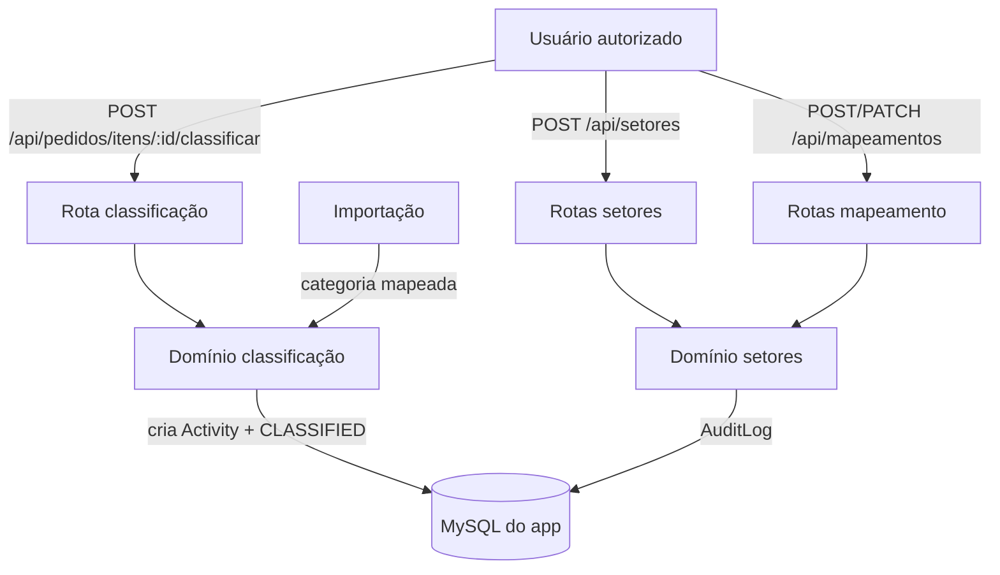

# Setores e Classificação de Itens — Design

**Spec**: `.specs/features/setores-e-classificacao/spec.md`
**Status**: Draft

---

## Architecture Overview

Domínio novo em `src/modules/setores/` (setores, mapeamento, classificação) com portas e adapters Prisma. A classificação cria uma `Activity` (item × setor) e marca o item como `CLASSIFIED`. A importação passa a classificar automaticamente quando a categoria do item tem mapeamento ativo.

---

## Code Reuse Analysis

### Existing Components to Leverage

| Component | Location | How to Use |
| --- | --- | --- |
| Guarda de token | `src/shared/http/internal-auth.ts` | Proteger as rotas com `APP_INTERNAL_TOKEN`. |
| Cliente Prisma | `src/shared/db/prisma.ts` | Repositórios. |
| Padrão de portas/adapters | `src/modules/integracao/*` | Mesmo padrão de domínio puro + adapter. |
| Schema Prisma | `prisma/schema.prisma` | `Sector`, `CategorySectorMapping`, `OrderItem`, `Activity`, `AuditLog`. |
| Importação | `src/modules/pedidos/importar-pedido.ts` | Ponto de auto-classificação na importação. |

### Integration Points

| System | Integration Method |
| --- | --- |
| Banco do app | Prisma, transações para classificação + Activity. |
| Importação (feature 1) | Porta de classificação injetada em `importarPedido`. |

---

## Components

### `gerenciar-setores`

- **Purpose**: Criar, listar e inativar setores.
- **Location**: `src/modules/setores/gerenciar-setores.ts`
- **Interfaces**: `criarSetor`, `listarSetores`, `inativarSetor`; porta `SectorRepository`.
- **Dependencies**: `SectorRepository`.
- **Reuses**: padrão de casos de uso da feature 1.

### `mapeamento`

- **Purpose**: Manter o de/para categoria → setor, com auditoria.
- **Location**: `src/modules/setores/mapeamento.ts`
- **Interfaces**: `criarMapeamento`, `alterarMapeamento`, `inativarMapeamento`; porta `MapeamentoRepository`.
- **Dependencies**: `MapeamentoRepository`.
- **Reuses**: `AuditLog` via porta.

### `classificar-item`

- **Purpose**: Classificar um item pendente, criar `Activity` e, se houver categoria, o mapeamento.
- **Location**: `src/modules/setores/classificar-item.ts`
- **Interfaces**: `classificarItem`, `classificarPorMapeamento`; porta `ClassificacaoRepository`.
- **Dependencies**: `ClassificacaoRepository`, `MapeamentoRepository`.
- **Reuses**: contratos e erros de domínio.

### `importar-pedido` (ajuste)

- **Purpose**: Auto-classificar itens cuja categoria tenha mapeamento ativo.
- **Location**: `src/modules/pedidos/importar-pedido.ts` (modificar)
- **Interfaces**: recebe uma porta de classificação opcional.
- **Dependencies**: porta de classificação.
- **Reuses**: fluxo existente da feature 1.

### Adapters e rotas

- `src/modules/setores/adapters/prisma-setores-repository.ts` — setores + mapeamento + auditoria.
- `src/modules/setores/adapters/prisma-classificacao-repository.ts` — item + Activity.
- `src/modules/setores/adapters/prisma-classificacao-automatica.ts` — porta de auto-classificação da importação.
- `src/app/api/setores/route.ts` — `GET`/`POST`.
- `src/app/api/mapeamentos/route.ts` — `GET`/`POST`/`PATCH`.
- `src/app/api/pedidos/itens/[itemId]/classificar/route.ts` — `POST`.

### Contrato de leitura de mapeamentos

`GET /api/mapeamentos?category=<categoria>` resolve o mapeamento da categoria informada. Não existe listagem de todos os mapeamentos nesta fatia: a leitura é sempre por categoria.

| Caso | Resposta |
| --- | --- |
| `category` presente e mapeamento existente | `200` com `{ mapping }` |
| `category` ausente | `400` com `{ error: 'invalid_category' }` |
| `category` presente e mapeamento ausente | `404` com `{ error: 'mapping_not_found' }` |
| Token interno ausente ou inválido | `401` com `{ error: 'unauthorized' }` |

---

## Data Models

Sem mudança de schema. Usa `Sector` (código único, ativo), `CategorySectorMapping` (categoria única), `OrderItem` (`classificationStatus`), `Activity` (`@@unique([orderItemId, sectorId])`) e `AuditLog`.

---

## Error Handling Strategy

| Error Scenario | Handling | User Impact |
| --- | --- | --- |
| Código de setor duplicado/vazio | `409`/`400` | Mensagem de conflito/validação. |
| Categoria já mapeada | `409` | Não cria duplicado. |
| Item já classificado | `409` | Sem mudança silenciosa. |
| Setor inexistente/inativo | `400` | Classificação rejeitada. |
| Categoria sem mapeamento | Mantém `PENDING_CLASSIFICATION` | Item continua pendente. |

---

## Risks & Concerns

| Concern | Location | Impact | Mitigation |
| --- | --- | --- | --- |
| `OrderItem` sem campo de setor | `prisma/schema.prisma` | Setor precisa de destino | Classificação cria `Activity` (item × setor). |
| Categoria indisponível | AWS `cad_produto` vazia | Item fica pendente | Mapeamento configurável; classificação manual. |
| Sem auth/perfis | rotas | Acesso indevido | Token interno `APP_INTERNAL_TOKEN` até a feature de auth. |
| Auto-classificação altera a importação | `importar-pedido.ts` | Regressão na feature 1 | Porta opcional; testes de regressão. |

---

## Tech Decisions

| Decision | Choice | Rationale |
| --- | --- | --- |
| Onde guardar o setor do item | Criar `Activity` (item × setor) | RF002 cria atividades; `OrderItem` não tem setor. |
| Chave do mapeamento | `categoriaLegado` | Fonte oficial é a categoria do legado. |
| Auditoria | `AuditLog` | Padrão do projeto. |
| Auto-classificação | Porta injetada em `importarPedido` | Mantém o domínio sem banco. |
