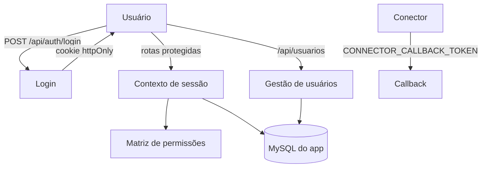

# Usuários, Perfis e Permissões — Design

**Spec**: `.specs/features/usuarios-e-permissoes/spec.md`
**Status**: Draft

---

## Architecture Overview

Domínio `src/modules/auth/` (senha, sessão, autenticação, contexto) e `src/modules/usuarios/` (usuários, permissões). Sessão em cookie httpOnly assinado com HMAC; senha com `scrypt`. As rotas de produção/ocorrência/entrega passam a usar a sessão; o callback do conector mantém o token de serviço.

---

## Code Reuse Analysis

| Component | Location | How to Use |
| --- | --- | --- |
| Guarda de token de serviço | `src/shared/http/internal-auth.ts` | Mantida para o callback do conector. |
| Cliente Prisma | `src/shared/db/prisma.ts` | Repositórios. |
| Padrão de portas | `src/modules/*` | Mesmo padrão. |
| Schema Prisma | `prisma/schema.prisma` | `User`, `UserRole`, `UserSector`, `Sector`. |

---

## Components

### `senha`

- **Purpose**: Gerar e verificar hash de senha com `scrypt`.
- **Location**: `src/modules/auth/senha.ts`
- **Interfaces**: `hashSenha(senha)`, `verificarSenha(senha, hash)`.

### `sessao`

- **Purpose**: Assinar e verificar o token de sessão.
- **Location**: `src/modules/auth/sessao.ts`
- **Interfaces**: `assinarSessao({ userId, expiraEm })`, `verificarSessao(token)`.

### `autenticar`

- **Purpose**: Validar credenciais e emitir sessão.
- **Location**: `src/modules/auth/autenticar.ts`
- **Interfaces**: `autenticar({ email, senha })`; porta `AuthRepository`.

### `auth-context`

- **Purpose**: Ler a sessão da requisição e aplicar a matriz.
- **Location**: `src/shared/http/auth-context.ts`
- **Interfaces**: `obterUsuario(request)`, `exigirPerfil(request, acao)`.

### `permissoes`

- **Purpose**: Matriz de perfis → ações.
- **Location**: `src/modules/usuarios/permissoes.ts`
- **Interfaces**: `pode(perfis, acao): boolean`.

### `gerenciar-usuarios`

- **Purpose**: CRUD de usuários, perfis e setores.
- **Location**: `src/modules/usuarios/gerenciar-usuarios.ts`
- **Interfaces**: `criarUsuario`, `atualizarUsuario`, `inativarUsuario`; porta `UsuariosRepository`.

### Adapter e rotas

- `src/modules/auth/adapters/prisma-auth-repository.ts`.
- `src/modules/usuarios/adapters/prisma-usuarios-repository.ts`.
- `src/app/api/auth/login/route.ts` — `POST`.
- `src/app/api/auth/sessao/route.ts` — `GET` (me) e `DELETE` (logout).
- `src/app/api/usuarios/route.ts` — `GET`/`POST`.
- `src/app/api/usuarios/[id]/route.ts` — `PATCH`.

---

## Data Models

Sem mudança de schema. Usa `User` (`passwordHash`, `status`), `UserRole`, `UserSector`, `Sector`.

Matriz de permissões (ações × perfis):

| Ação | Perfis permitidos |
| --- | --- |
| consultar_pedidos | todos |
| registrar_execucao | OPERATOR, PRODUCTION_MANAGER |
| registrar_ocorrencia | OPERATOR, PRODUCTION_MANAGER |
| definir_prioridade | PRODUCTION_MANAGER |
| registrar_entrega | SHIPPING, PRODUCTION_MANAGER |
| autorizar_excecao | PRODUCTION_MANAGER |
| classificar_item | PRODUCTION_MANAGER, SYSTEM_RESPONSIBLE |
| solicitar_importacao | PRODUCTION_MANAGER, TECHNICAL_RESPONSIBLE, SYSTEM_RESPONSIBLE |
| gerenciar_usuarios | SYSTEM_RESPONSIBLE |
| gerenciar_setores | SYSTEM_RESPONSIBLE |
| monitorar_integracao | TECHNICAL_RESPONSIBLE, SYSTEM_RESPONSIBLE |
| definir_prazo | PRODUCTION_MANAGER, SELLER |

---

## Error Handling Strategy

| Error Scenario | Handling | User Impact |
| --- | --- | --- |
| Credenciais inválidas / usuário inativo | `401` | Não entra. |
| Sem sessão ou token adulterado | `401` | Precisa logar. |
| Sem perfil para a ação | `403` | Sem permissão. |
| Email duplicado | `409` | Conflito. |
| Dados inválidos | `400` | Validação. |

---

## Risks & Concerns

| Concern | Location | Impact | Mitigation |
| --- | --- | --- | --- |
| `SESSION_SECRET` ausente | env | Sessão insegura | Exigir a variável; falhar sem ela. |
| Rotas antigas com `x-user-id` | `src/app/api/**` | Bypass de auth | Substituir pela sessão na fase de hardening. |
| Permissões ambíguas | matriz | Ação liberada indevidamente | Assunções registradas; revisar com o cliente. |
| Callback do conector | `src/app/api/integracao/callback` | Acesso de serviço | Mantém token de serviço próprio. |

---

## Tech Decisions

| Decision | Choice | Rationale |
| --- | --- | --- |
| Sessão | Cookie httpOnly assinado (HMAC) | Sem dependência nova; portátil. |
| Senha | `crypto.scrypt` | Sem dependência nova. |
| Autorização | Matriz no servidor | RF014. |
| Callback | Token de serviço | É serviço, não usuário. |
| Contexto temporário | Removido das rotas de usuário | Endurece as features 2–5. |
